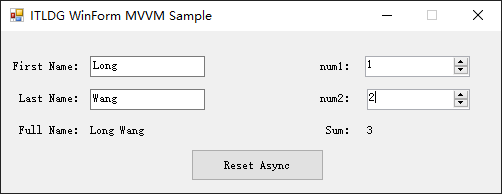
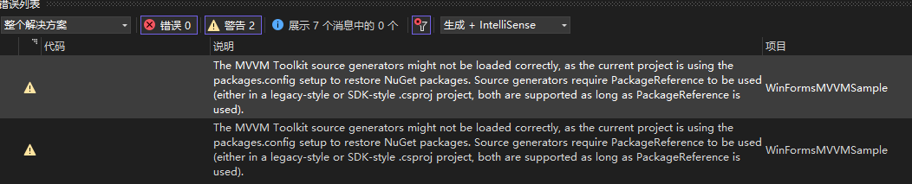
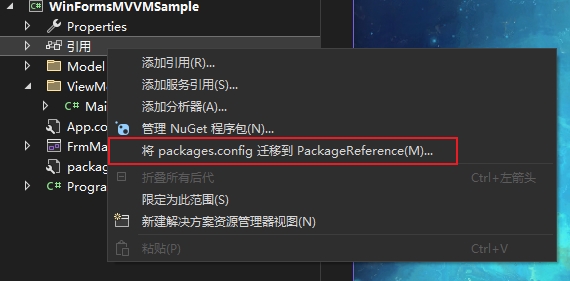
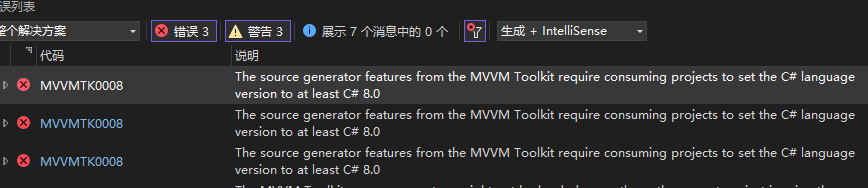

# WinForm MVVM Sample



目标框架：.NET Framework 4.8

项目类型: WinForm

使用库:CommunityToolkit.Mvvm

## 绑定方式

```csharp
public FrmMain()
{
    InitializeComponent();
    InitMVVM();
}
void InitMVVM()
{


    MainViewModel mainViewModel = new MainViewModel();

    txtFirstName.DataBindings.Add("Text", mainViewModel.Person, nameof(mainViewModel.Person.FirstName), false, DataSourceUpdateMode.OnPropertyChanged);
    txtLastName.DataBindings.Add("Text", mainViewModel.Person, nameof(mainViewModel.Person.LastName), false, DataSourceUpdateMode.OnPropertyChanged);
    lblFullName.DataBindings.Add("Text", mainViewModel.Person, nameof(mainViewModel.Person.FullName));

    nud1.DataBindings.Add("Value", mainViewModel, nameof(mainViewModel.Num1), false, DataSourceUpdateMode.OnPropertyChanged);
    nud2.DataBindings.Add("Value", mainViewModel, nameof(mainViewModel.Num2), false, DataSourceUpdateMode.OnPropertyChanged);
    lblSum.DataBindings.Add("Text", mainViewModel, nameof(mainViewModel.Sum));

    btnReset.Click += (object sender, EventArgs e) => mainViewModel.ResetCommand.Execute(null);
    btnReset.DataBindings.Add("Enabled", mainViewModel, nameof(mainViewModel.CanClick));

}
```

## 过程记录

使用 Nuget 安装 CommunityToolkit.Mvvm

安装完成后代码出现警告



```
The MVVM Toolkit source generators might not be loaded correctly, as the current project is using the packages.config setup to restore NuGet packages. Source generators require PackageReference to be used (either in a legacy-style or SDK-style .csproj project, both are supported as long as PackageReference is used).	
```

解决方法,将`packages.config` 迁移到 `PackageReference`



解决完这个问题后出现语言版本过低的错误,[MVVM 工具包错误 MVVMTK0008](https://learn.microsoft.com/zh-cn/dotnet/communitytoolkit/mvvm/generators/errors/mvvmtk0008)

```
The source generator features from the MVVM Toolkit require consuming projects to set the C# language version to at least C# 8.0
```



解决方法,编辑项目文件

```xml
<LangVersion>7.3</LangVersion>
```

修改为

```xml
<LangVersion>latest</LangVersion>
```
